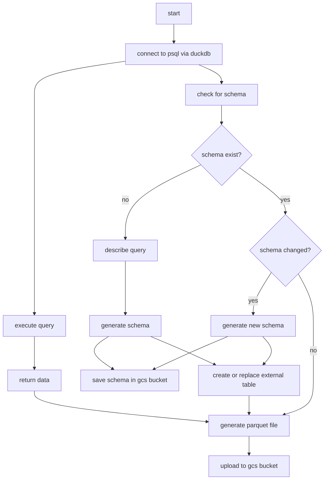

# Script Flow

```mermaid
flowchart TD

a[start]
b[connect to psql via duckdb]
c[execute query]
d[return data]
e[generate parquet file]
f[upload to gcs bucket]

a-->b-->c-->d-->e-->f

bw[check for schema]
bq{schema exist?}
ba[describe query]
bb[generate schema]
bc[save schema in gcs bucket]
bd[create or replace external table]
bca{schema changed?}
bcb[generate new schema]

b-->bw-->bq
bq-->|no| ba
bq-->|yes| bca

ba-->bb-->bc

bca-->|yes| bcb
bca-->|no| e

bcb-->bc
bb-->bd
bcb-->bd

bd-->e
```
