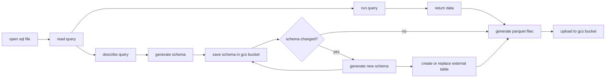

```mermaid
flowchart LR;
    a[open sql file]
    b[read query]
    c[run query]
    d[return data]
    e[generate parquet filec]
    f[upload to gcs bucket]

    a-->b-->c-->d-->e-->f

    b-->ba[describe query]
    ba-->bb[generate schema]-->bc[save schema in gcs bucket]
    bc-->bca{schema changed?}
    bca-->|no| e
    bca-->|yes| bcb[generate new schema]
    bcb-->bc
    bcb-->bd[create or replace external table]
    bd-->e
```
